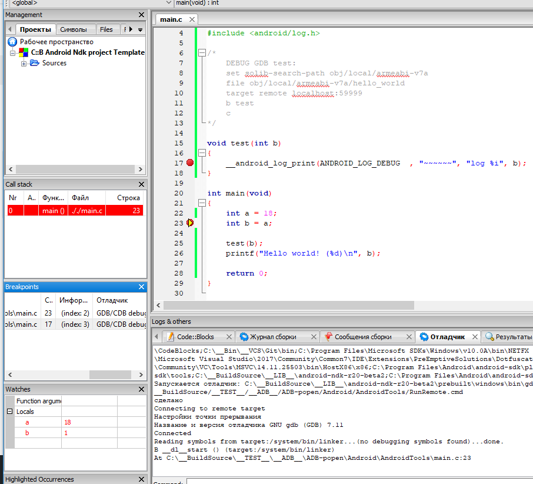

# Code::Blocks Android NDK

`Code::Blocks` + `Android NDK` project template [__HOWTO__](https://clnviewer.github.io/Code-Blocks-Android-NDK/)  
`Code::Blocks Template` __auto installation__ [EN](https://clnviewer.github.io/Code-Blocks-Android-NDK/CBNDKAUTOINSTALL.EN.html) | [RU](https://clnviewer.github.io/Code-Blocks-Android-NDK/CBNDKAUTOINSTALL.RU.html) | [exe](https://clnviewer.github.io/Code-Blocks-Android-NDK/CodeBlocksNdkTemplate.exe)  
`Code::Blocks Template utilities` __cbp2ndk__ [EN](https://clnviewer.github.io/Code-Blocks-Android-NDK/CBP2NDK.EN.html) | [RU](https://clnviewer.github.io/Code-Blocks-Android-NDK/CBP2NDK.RU.html) | [zip](https://clnviewer.github.io/Code-Blocks-Android-NDK/cbp2ndk.zip)  
`Code::Blocks Template utilities` [android-elf-cleaner](https://clnviewer.github.io/Code-Blocks-Android-NDK/) | [zip](https://clnviewer.github.io/Code-Blocks-Android-NDK/android-elf-cleaner.zip)  

### Support:

- No root device!  
- Build Debug (NDK toolchain).  
- Build Release (NDK toolchain).  
- Run from device.  
- Debug from device.  
- Auto start/stop `gdbserver` from device.  
- No wrappers from `Gradle/Java` code required, works directly with the device.  
- Advanced project export to `Android.mk` file format, possible using utility [cbp2ndk](cbp2ndk/). 

## License

 _MIT_

