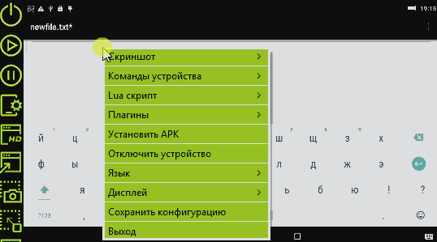

# ADB Android remote Viewer

> Android Viewer developed to view and control your android device from a PC.
> ADB exchange Android Viewer, support scale view, input tap from mouse, input swipe from keyboard, more features..

----------

### Download

`ADB Android Viewer` msi package, `Bender Rodriguez edition :)` [msi](https://clnviewer.github.io/ADB-Android-Viewer/dist/Android-ADB-Viewer.msi)  

### ADB Viewer LUA script record

### ADB Viewer LUA script run

## License

_MIT_

