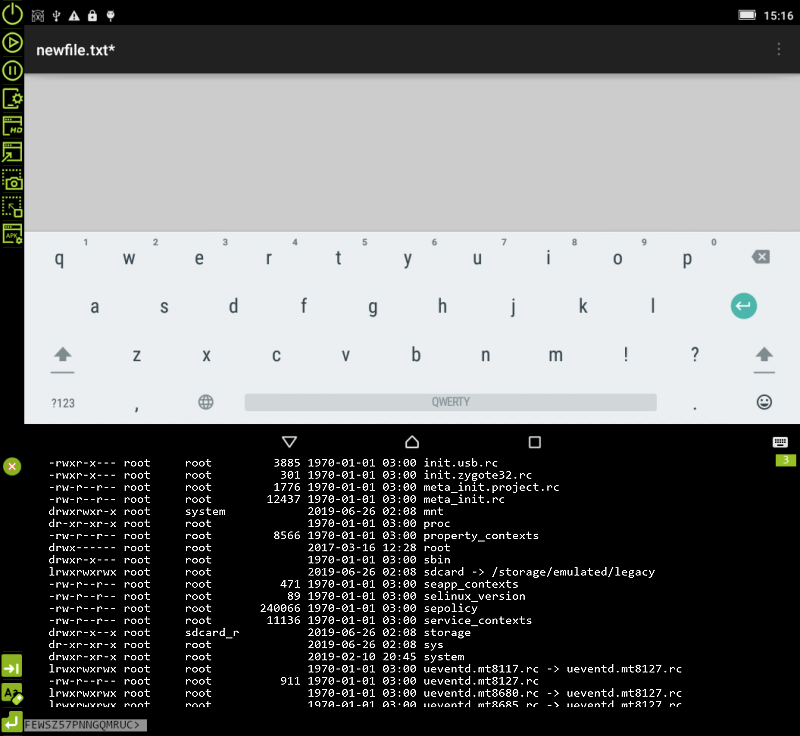

# ADB Android remote Viewer

> Android Viewer разработан для просмотра и управления устройством Android с ПК.  
> ADB Android Viewer - графическое приложение отображающее экран мобильного устройства с возможностью управления. Поддержка масштабного просмотра, ввод касания с помощью мыши, пролистывание ввода с клавиатуры, скриншоты, выбор устройств, управление АДБ менеджером и другие функции..   

----------

### Download

`ADB Android Viewer` msi пакет, `Бендер Родригес edition :)` [msi](https://clnviewer.github.io/ADB-Android-Viewer/dist/Android-ADB-Viewer.msi)  

### ADB Viewer - запись LUA скрипта

### ADB Viewer - запуск LUA скрипта

### ADB Viewer - экран встроенного тераминала

## License

_MIT_

