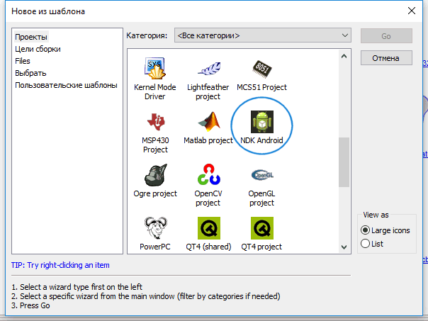
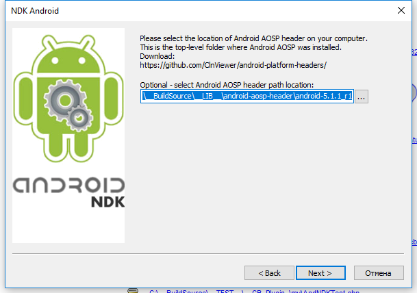
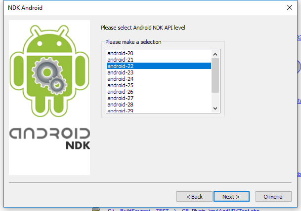
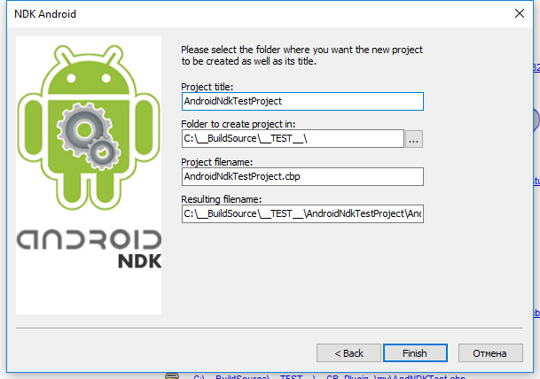

### Installing the NDK installer C :: B template

 ----------

 - Download the installer `NDK C :: B template` [CodeBlocksNdkTemplate v.0.0.14.79 / win32 (07/03/2019)] (https://clnviewer.github.io/Code-Blocks-Android-NDK/CodeBlocksNdkTemplate.exe)
 - Run the installer and install the `NDK C :: B template`
 - Edit the file `config.script` and add the template to the list used.

 ### Editing the C :: B file with config.script

 The file must be in the following path:
 
 
 
 You must add the following code to the `RegisterWizards ()` function:
 
 
 Before using the template, after making these changes, you must restart `C :: B`
 
 
 ### NDK C::B template Wizard

### Features

 > __Bag? __: unfortunately I did not find a direct way to add debugger parameters directly to the `C :: B` project using its API.
 > Currently, the debugger parameters are entered into the `Extensions / debugger1` section, but for operation it is necessary that these parameters be in the` Extensions / debugger` section.
 > After creating the project, use the editor to remove the `Extensions / debugger` section and rename the` Extensions / debugger1` section to `Extensions / debugger`.
 > An example of the contents of this section is given below.
 
 
 > __Attention! __: the `cbp2ndk` and` android-elf-cleaner` utilities used in `NDK C :: B template` are built for the 32bit version of Windows.
 > If you are using a 64bit platform and want to have executable files of the corresponding bitness, you need to rebuild the project yourself.
 > The `cbp2ndk` and` android-elf-cleaner` utilities in `C :: B` are located along the following path:
 
 
 
