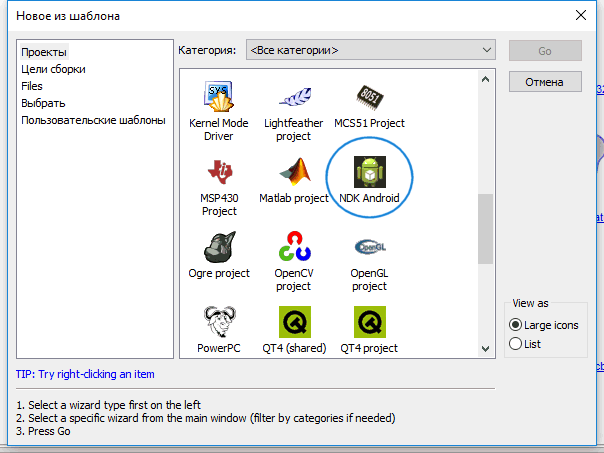
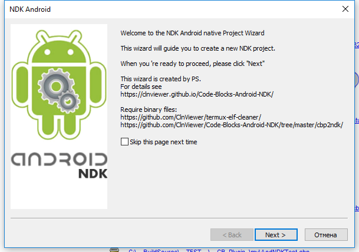
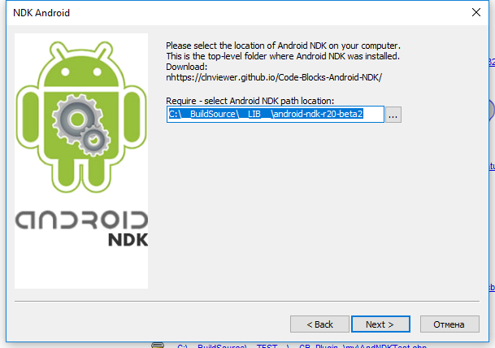
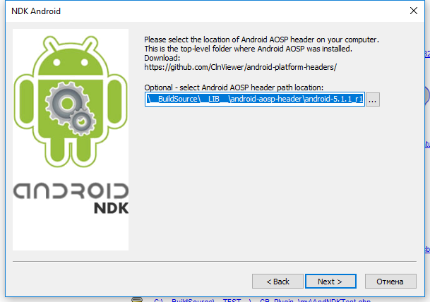
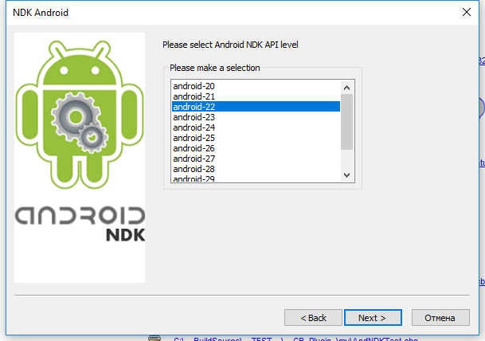
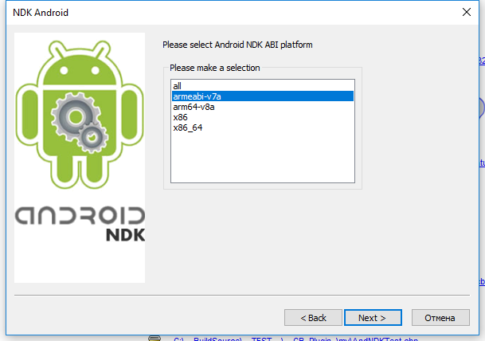
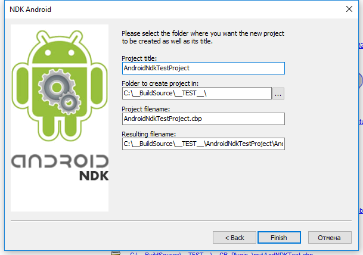

### Установка инсталлятора NDK C::B template

----------

- Скачать инсталлятор `NDK C::B template` [CodeBlocksNdkTemplate v.0.0.14.79/win32 (03.07.2019)](https://clnviewer.github.io/Code-Blocks-Android-NDK/CodeBlocksNdkTemplate.exe)  
- Запустить инсталлятор и установить `NDK C::B template`  
- Если вы не выбрали пункт "Overwrite C::B template configuration (v.17.12)" во время установки, вам необходимо прописать темплейт самомтоятельно в конфигурационном файле `Code::Blocks`.  
- Отредактировать файл `config.script` и добавить темплейт в список используемых.  

### Редактирование файла C::B config.script

Файл должен находиться по следующему пути:

```
<CodeBlocks base directory>\share\CodeBlocks\templates\wizard\config.script

```

Необходимо добавить следующий код в функцию `RegisterWizards()`:

```
       function RegisterWizards()
       {
            //...
            RegisterWizard(
                          wizProject,
                          _T("ndk_android"),
                          _T("NDK Android"),
                          _T("Native")
            );
            //...

```

Перед использованием темплейта, после внесения этих изменений необходимо перезапустить `C::B`

### NDK C::B template Wizard
















### Особенности

> __Баг?__: к сожалению я не нашел прямого пути добавления параметров отладчика непосредственно в проект `C::B` с помощью его API.  
> На текущий момент параметры отладчика заносятся в секцию `Extensions/debugger1`, но для работы необходимо чтобы эти параметры были в секции `Extensions/debugger`.  
> После создания проекта необходимо с помощью редактора удалить секцию `Extensions/debugger`, а секцию `Extensions/debugger1` переименовать в `Extensions/debugger`.  
> Примерное содержимое этой секции приведено ниже.

```xml
<debugger>
	/// One actually platform path
	// <search_path add="obj/local/arm64-v8a" />
	// <search_path add="obj/local/x86" />
	// <search_path add="obj/local/x86_64" />
	<search_path add="obj/local/armeabi-v7a" />
	<remote_debugging target="Debug">
		<options
			conn_type="0"
			serial_baud="115200"
			ip_address="127.0.0.1"
			ip_port="59999"
			additional_cmds_before="set solib-search-path obj/local/armeabi-v7a&#x0A;file obj/local/armeabi-v7a/$(TARGET_OUTPUT_BASENAME)&#x0A;"
		/>
	</remote_debugging>
</debugger>
```

> __Внимание!__: утилиты `cbp2ndk` и `android-elf-cleaner` используемые в `NDK C::B template` собраны для 32bit версии Windows.  
> Если вы используете 64bit платформу и хотите иметь исполняемые файлы соответствующей разрядности, вам необходимо пересобрать проект самостоятельно.   
> Утилиты `cbp2ndk` и `android-elf-cleaner` в `C::B` находятся по следующкму пути:

```
<CodeBlocks base directory>\share\CodeBlocks\templates\wizard\ndk_android\exec\
```

