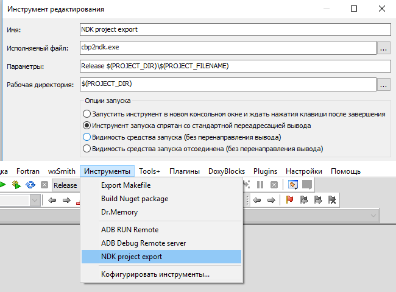

### cbp2ndk export utility

The goal of the `cbp2ndk` utility is to transfer settings and settings made in `Code::Blocks` to the format of `Android NDK`

### Supported C::B configuration blocks:

- both global settings blocks and corresponding tags are supported  
- compiler flags settings  
- setting options linker  
- list of link libraries  
- list of compiled project files  

### Data conversion for NDK configuration, Android.mk file:

- automatic calculation of paths for `include` and their inclusion in the variable `LOCAL_C_INCLUDES`  
- automatic calculation of connected libraries and their inclusion in the variable `LOCAL_LDLIBS`  
- automatic calculation of extensions of compiled files and their inclusion in the variable `LOCAL_CPP_EXTENSION`  
- automatic distribution of flags between the variables `LOCAL_CFLAGS` and `LOCAL_CPPFLAGS` according to their language  
- listing the compiled project files and adding them to the variable `LOCAL_SRC_FILES`  
- export the command line for the autorun application from `Project -> Program launch parameters` in `Makefile` and the startup script  
- if the file `Android.mk` is not in the directory pointed to by the path to the `.cbp` project, it will be created automatically.  If you create `Android.mk`, the name for the application will be taken from the name of the project and all the specials.  characters and spaces will be replaced with the underscore `_`.  
- the files `Application.mk` and `Makefile` in the absence of the directory pointed to by the path to the project `.cbp`, will be created automatically.  In `Makefile` you need to edit the variable` NDKROOT` indicating the path to `Android NDK` on your system.  
- by default, the debug print library for Android, liblog is always included in the variable `LOCAL_LDLIBS`, and the project root directory is included in the variable `LOCAL_C_INCLUDES`  

### Rewritable variables in the Android.mk file:

The following variables can be overwritten, do not fill them in manually.

- `LOCAL_CPP_EXTENSION`  
- `LOCAL_SRC_FILES`  
- `LOCAL_CFLAGS`  
- `LOCAL_CPPFLAGS`  
- `LOCAL_LDFLAGS`  
- `LOCAL_LDLIBS`  
- `LOCAL_C_INCLUDES`  
- `LOCAL_MODULE` (in case of file creation)  

Variables not included in this list will be saved with the values ​​and overwritten with the new configuration.

### Command line parameters:

        Options:
           -a, --auto      find .cbp project file from current directory
           -c, --cbp       path to .cbp project file
           -d, --dump      dump current configuration
           -t, --tag       building tag: Debug|Release|OtherTag
           -q, --quiet     quiet all messages
           -v, --verbose   verbose output to console
           -n  --nodefault no set default values (libs, include paths)
               --cbtmpl    install C::B wizard template Makefile file
               --api       android API number (Application.mk)
               --abi       android ABI platform (Application.mk)
               --ndkopt    android NDK options (Application.mk)

        Using:
           cbp2ndk.exe <BuildTag> <path\project.cbp>
           cbp2ndk.exe -t <BuildTag> -c <path\project.cbp> -v
           cbp2ndk.exe -a --api android-28 --abi armeabi-v7a --ndkopt debug
           cbp2ndk.exe -a

### Adding a menu to C::B

### Sources:

Download [cbp2ndk v.0.0.14.79 / win32 (07/03/2019)](https://clnviewer.github.io/Code-Blocks-Android-NDK/cbp2ndk.zip)  
See [cbp2ndk directory](https://github.com/ClnViewer/Code-Blocks-Android-NDK/tree/master/cbp2ndk)  
Learn more about the format and capabilities of the file [Android.mk](https://developer.android.com/ndk/guides/android_mk)  
 

### Recommendations:

> Always use a Unix-style slash (/) in assembly files.  The build system incorrectly handles the backslash in Windows style.  

> Try not to change the level of optimization / debugging in your `Android.mk` file.  This allows the build system to generate useful data files used during debugging.  It is meant to exclude the use of the flags `-g`,` -s`, `-O` and their analogues.  
 
## License
 
  _MIT_
 
  
 
