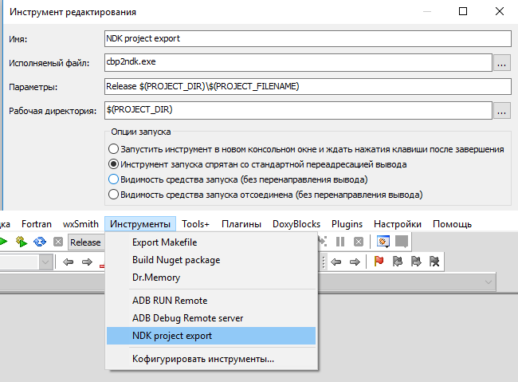

# утилита экспорта cbp2ndk

Цель утилиты `cbp2ndk`- перенос настроек и установок сделанных в `Code::Blocks` в формат `Android NDK`

### Поддерживаемые блоки конфигурации C::B:

- поддерживаются как глобальные блоки настроек, так и соответствующие тегу сборки

- настройки флагов компилятора

- настройки опций линкера

- список подключаемых библиотек

- список компилируемых файлов проекта

### Преобразование данных для конфигурации NDK, файл Android.mk:

- автоматическое вычисление путей для `include` и включение их в переменную `LOCAL_C_INCLUDES`

- автоматическое вычисление подключаемых библиотек и включение их в переменную `LOCAL_LDLIBS`

- автоматическое вычисление расширений компилируемых файлов и включение их в переменную `LOCAL_CPP_EXTENSION`

- автоматическое распределение флагов между переменными `LOCAL_CFLAGS` и `LOCAL_CPPFLAGS` в соответствии с принадлежностью к языку

- составление списка компилируемых файлов проекта и добавление их в переменную `LOCAL_SRC_FILES`

- экспорт командной строки автозапуска приложения из `Проект -> Параметры запуска программы` в `Makefile` и скрипт запуска

- если файл `Android.mk` отсутствует в каталоге на который указывает путь до проекта `.cbp`, он будет создан автоматически. В случае создания `Android.mk` имя для приложения будет взято из названия проекта и все спец. символы и пробелы будут заменены на нижнее подчеркивание `_`.

- файлы `Application.mk` и `Makefile` в случае отсутствия в каталоге на который указывает путь до проекта `.cbp`, будут созданы автоматически. В `Makefile` необходимо отредактировать переменную `NDKROOT` указывающую на путь к `Android NDK` на вашей системе.

- по умолчанию, в переменную `LOCAL_LDLIBS` всегда включается библиотека отладочной печати для `Android`, `liblog`, а в переменную `LOCAL_C_INCLUDES` включаеться корневая директория проекта `./`

### Перезаписываемые переменные в файле Android.mk:

Указанные ниже переменные могут быть перезаписаны, не заполняйте их в ручную.  

- `LOCAL_CPP_EXTENSION`

- `LOCAL_SRC_FILES`

- `LOCAL_CFLAGS`

- `LOCAL_CPPFLAGS`

- `LOCAL_LDFLAGS`

- `LOCAL_LDLIBS`

- `LOCAL_C_INCLUDES`

- `LOCAL_MODULE` (в случае создания файла)

Переменные не вошедшие в этот список будут сохранены вместе со значениями и перезаписаны вместе с новой конфигурацией.

### Параметры командной строки:

        Options:
           -a, --auto      find .cbp project file from current directory
           -c, --cbp       path to .cbp project file
           -d, --dump      dump current configuration
           -t, --tag       building tag: Debug|Release|OtherTag
           -q, --quiet     quiet all messages
           -v, --verbose   verbose output to console
           -n  --nodefault no set default values (libs, include paths)
               --cbtmpl    install C::B wizard template Makefile file
               --api       android API number (Application.mk)
               --abi       android ABI platform (Application.mk)
               --ndkopt    android NDK options (Application.mk)

        Using:
           cbp2ndk.exe <BuildTag> <path\project.cbp>
           cbp2ndk.exe -t <BuildTag> -c <path\project.cbp> -v
           cbp2ndk.exe -a --api android-28 --abi armeabi-v7a --ndkopt debug
           cbp2ndk.exe -a

### Добавление меню в C::B

### Источники:

Скачать [cbp2ndk v.0.0.14.79/win32 (03.07.2019)](https://github.com/ClnViewer/Code-Blocks-Android-NDK/raw/master/cbp2ndk/dist/cbp2ndk.zip) 

Перейти в директорию [cbp2ndk](https://github.com/ClnViewer/Code-Blocks-Android-NDK/tree/master/cbp2ndk)

Более подробно о формате и возможностях файла [Android.mk](https://developer.android.com/ndk/guides/android_mk)

### Рекомендации:

> Всегда используйте косую черту в стиле Unix (/) в файлах сборки. Система сборки неправильно обрабатывает обратную косую черту в стиле Windows.
   
> Постарайтесь не изменять уровень оптимизации / отладки в вашем Android.mk файле. Это позволяет системе сборки генерировать полезные файлы данных, используемые во время отладки. Имеется в виду исключить употребление флагов `-g`, `-s`, `-O.` и их аналогов.

