Let's start small, how to screw the `Android NDK` to `C::B`  

There are two ways:

- 1. register a profile for each platform, with executable files according to the platform.  In my opinion it is tiring, a lot of things and it is not clear why.  Given that if you collect the same for all platforms, the volume of gestures with switching configurations is quite large.  My default is to build arm64-v8a, armeabi-v7a, x86, x86_64.  
- 2. use the native build system `ndk-build`.  This is the simplest and most elegant solution that does not conflict with most of the `C::B` checks, but in the` C::B` settings every detail is important, the scheme is quite capricious, and with inaccuracies it can easily break.  

### Solution features with ndk-build:

- no rooted device required  
- full assembly debugging, without additional tools (NDK tool kit)  
- full build in `Debug/Release` modes  
- full launch of the application (from the device)  
- auto start/stop `gdbserver` from the device  
- no wrappers from `Gradle/Java` code required, works directly with the device  
- full integration of the `C::B` projects when using the export utility [cpb2ndk](CBP2NDK.EN.md).  

### Android NDK Integration

----------

- __The first way__: download and install the ready installer `NDK C::B template`, [more ..](CBNDKAUTOINSTALL.EN.md)
- __Path two__: in manual mode, set `NDK C::B template` for each project, as described below.

----------

The ideology and manner of building an application using the Android NDK toolchain is as close as possible to the typical behavior of `C::B`, the process logic:  

- build in the `Release` mode - stages: always a new build of the application, copying it to the device, launching the application.  All actions are displayed in the console `C::B`.  
- build in `Debug` mode: always new build of application, copying it to device, copying `NDK-part` of files for debugging `gdbserver`, `gdb.setup`, launching `gdbserver` on device, waiting for connection of debager `GDB` for debugging.  
- `application launch` mode: steps: launching an application on a device with outputting results to the console.  
- `Debug -> Start` mode - stages: always a new build of the application, copying it to the device, copying the `NDK-part` files for debugging `gdbserv`, `gdb.setup`, launching `gdbserv` on the device, automatically connecting the debugger  `GDB` and switch to debug mode.  
- in the `Debug`, `Debug -> Start` modes, the window being launched by `gdbserver` starts in a minimized state and automatically closes when the debugging is finished.  
 
 
### Template files:

The project itself `C::B`, important sections:  

- `<Build><Option output>` - indicates the script for remote launch of the application on the device - `RunRemote.cmd`.  The script is generated automatically.  
- `<Build><Option compiler="android_ndk-build ">` is the processed name of the compiler in the `C::B` settings - `Android NDK-Build`.  How to create a new compiler account is shown below.  

The `<Extensions><debugger><remote_debugging>` section contains settings for remote debugging implemented with `GDB`:  

- `options ip_address="127.0.0.1" ip_port="59999 "extended_remote="0"`, if there is a need to change the port number, then this must also be done in `Makefile`.  If the `extended_remote` option is nonzero, the remotely running gdbserver window will not close automatically after debugging.  

[**AndroidNdkTemplate.cbp**](https://github.com/ClnViewer/Code-Blocks-Android-NDK/blob/master/CB-Template/AndroidNdkTemplate.cbp) - the project file `C::B`.  

> If during the launch of the assembled application on the device you experience the following errors:  

    WARNING: linker: /data/local/tmp/youprog: unused DT entry: type 0x6ffffef5 arg 0x4040
    WARNING: linker: /data/local/tmp/youprog: unused DT entry: type 0x6ffffffe arg 0x5a34
    WARNING: linker: /data/local/tmp/youprog: unused DT entry: type 0x6fffffff arg 0x2

> Use [android-elf-cleaner](https://github.com/ClnViewer/Code-Blocks-Android-NDK/android-elf-cleaner)  
> These errors are typical for the binary file of the platform `armeabi-v7a`, they were later corrected in the latest versions of libraries.  

Download [android-elf-cleaner v.0.0.14.79/win32 (07.03.2019)](https://clnviewer.github.io/Code-Blocks-Android-NDK/android-elf-cleaner.zip)  
 
### Source assembly control files in the NDK project directory:

----------

[**Application.mk**](https://github.com/ClnViewer/Code-Blocks-Android-NDK/blob/master/CB-Template/Application.mk) - set the build parameters.  
[**Android.mk**](https://github.com/ClnViewer/Code-Blocks-Android-NDK/blob/master/CB-Template/Android.mk) - this is the make-up file unique for each `NDK` project (application).  
[**Makefile**](https://github.com/ClnViewer/Code-Blocks-Android-NDK/blob/master/CB-Template/Makefile) - `C::B` starts directly:  

The `Application.mk` and `Makefile` files are universal for all projects collected using `NDK` and do not require revisions.  
To understand the structure of where the application lies in the project `NDK`, I will give a tree  

    │   Android.mk
    │   AndroidNdkTemplate.cbp
    │   Application.mk
    │   main.c
    │   Makefile
    │   
    ├───libs
    │   ├───arm64-v8a
    │   │       gdb.setup
    │   │       gdbserver
    │   │       hello_world
    │   ├───armeabi-v7a
    │   │       gdb.setup
    │   │       gdbserver
    │   │       hello_world
    │   ├───x86
    │   │       gdb.setup
    │   │       gdbserver
    │   │       hello_world
    │   └───x86_64
    │           gdb.setup
    │           gdbserver
    │           hello_world
    │           
    └───obj
        └───local
            ├───arm64-v8a
            │   │   hello_world
            │   ├───objs
            │   │   └───hello_world
            │   └───objs-debug
            │       └───hello_world
            │               main.o
            │               main.o.d
            ├───armeabi-v7a
            │   │   hello_world
            │   │   
            │   ├───objs
            │   │   └───hello_world
            │   └───objs-debug
            │       └───hello_world
            │               main.o
            │               main.o.d
            ├───x86
            │   │   hello_world
            │   │   
            │   ├───objs
            │   │   └───hello_world
            │   └───objs-debug
            │       └───hello_world
            │               main.o
            │               main.o.d
            └───x86_64
                │   hello_world
                │   
                ├───objs
                │   └───hello_world
                └───objs-debug
                    └───hello_world
                            main.o
                            main.o.d

### View of project settings from GUI C::B:

----------

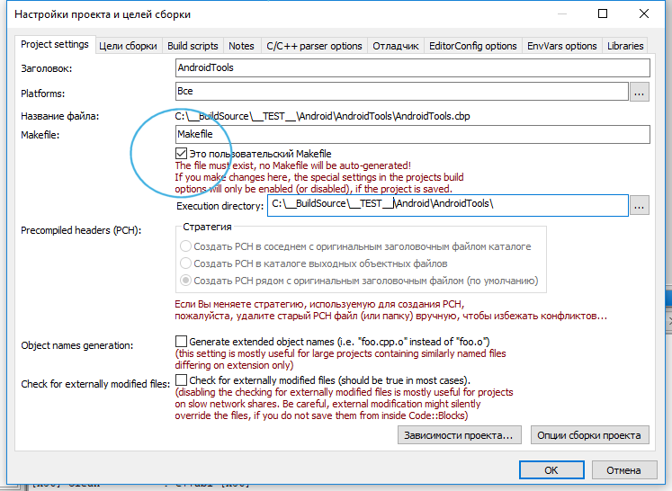

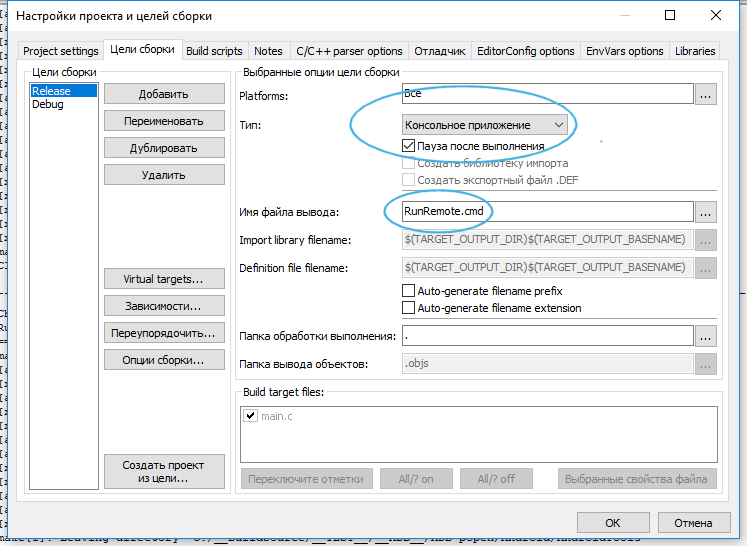

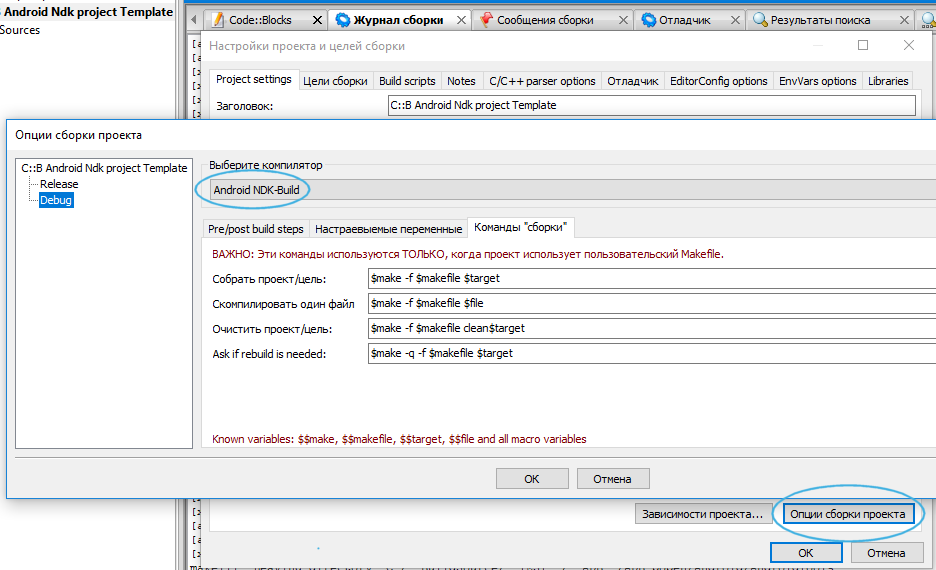

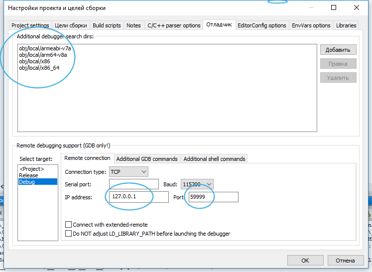

Be sure to indicate the possible paths where the object files with debugging symbols are located:  

- `obj/local/armeabi-v7a`  
- `obj/local//arm64-v8a`  
- `obj/local/x86`  
- `obj/local/x86_64`  

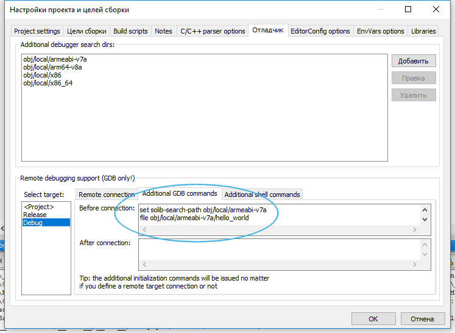

It is necessary to add the `GDB` commands that transmit information about the finding of debugging symbols for the platform of the connected device:  

- `set solib-search-path obj/local/armeabi-v7a` - the location of the debug symbols for the active device.  
- `file obj/local/armeabi-v7a/<application name>`  - is the name of the application being debugged.  
 
 
### Type of compiler settings in C::B:

----------

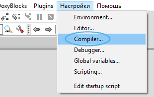

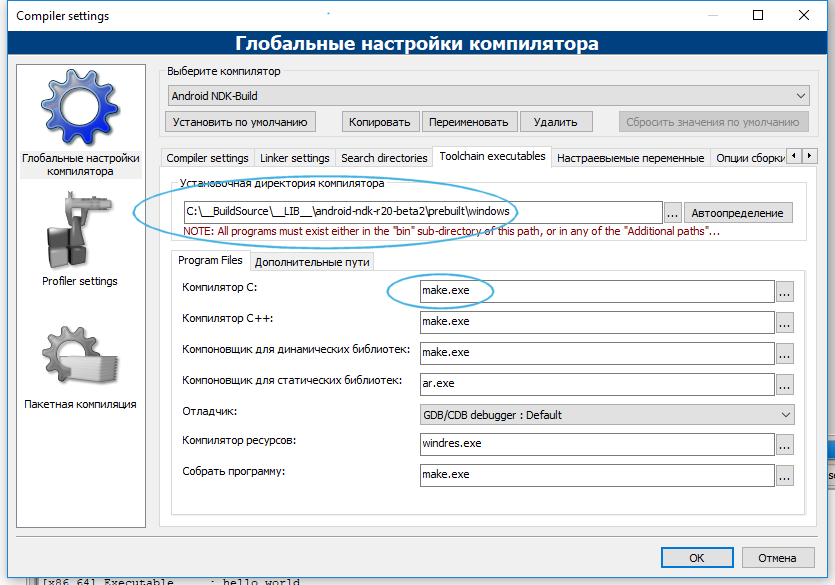

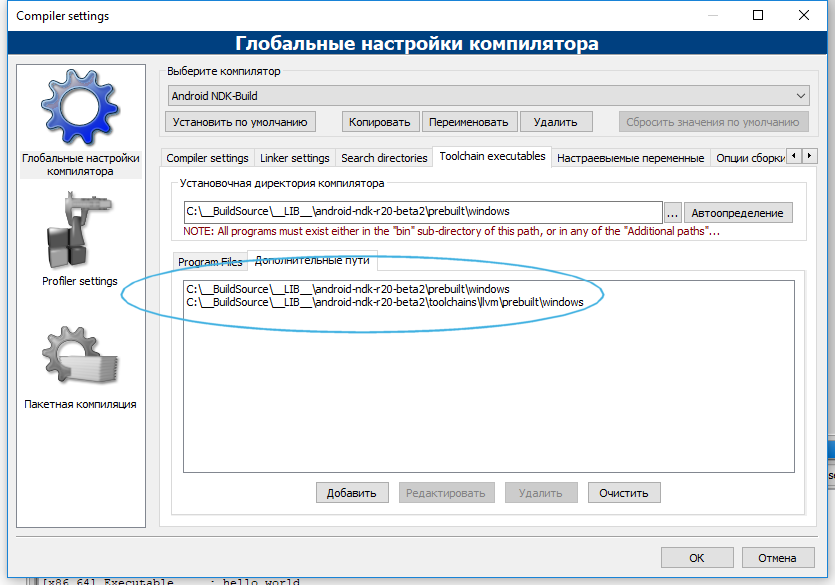

### Additional NDK application debug menu:

----------

Both scripts used in the menu have a fixed name and are automatically generated during execution of `Makefile`, for convenience, it is reasonable to add them to the menu:  

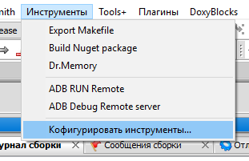

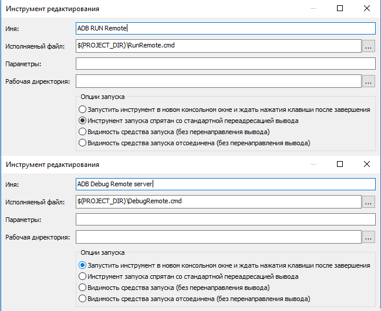

The debugging method of the application consists of standard actions, for example through `F8` or the menu `Debugging -> Start`.  As soon as the debugger is launched, you need to call the `ADB Debug Remote server` item from the created menu; with this command you will start the `GDB server` on the device that will start your application.  You connect to the `GDB server` remotely and can conduct a debugging session.  
In `Debug` mode, the remote server is started automatically and does not require calling this menu item.  
See a screenshot of the debugger settings in the project above.  

This debugger startup scheme supports non-rooted devices.  
 
### Global debager settings for NDK look like this:

 ----------

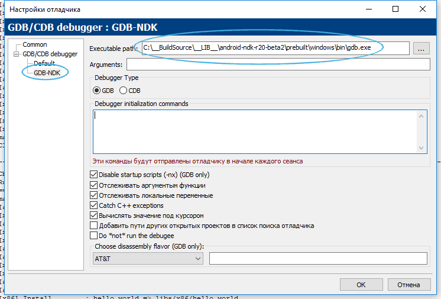

### Debugging on device:

----------

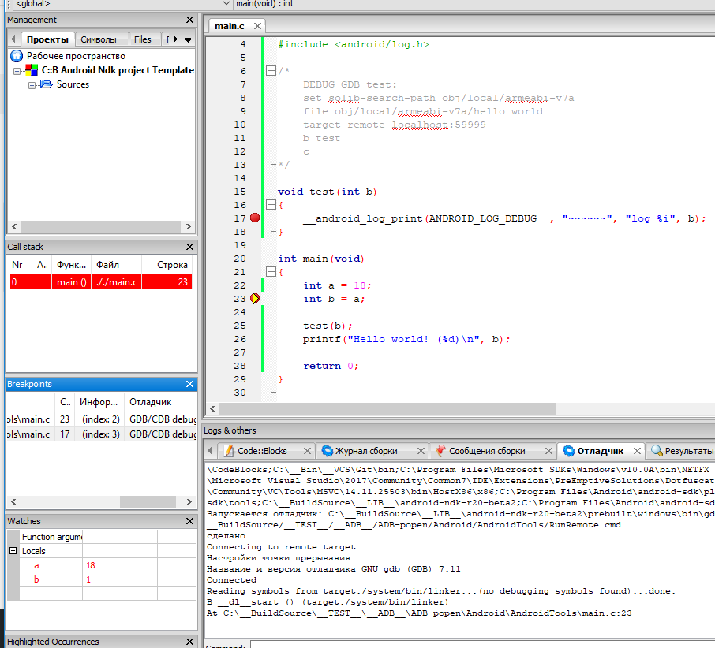

### Result of assembling an application with NDK:

----------

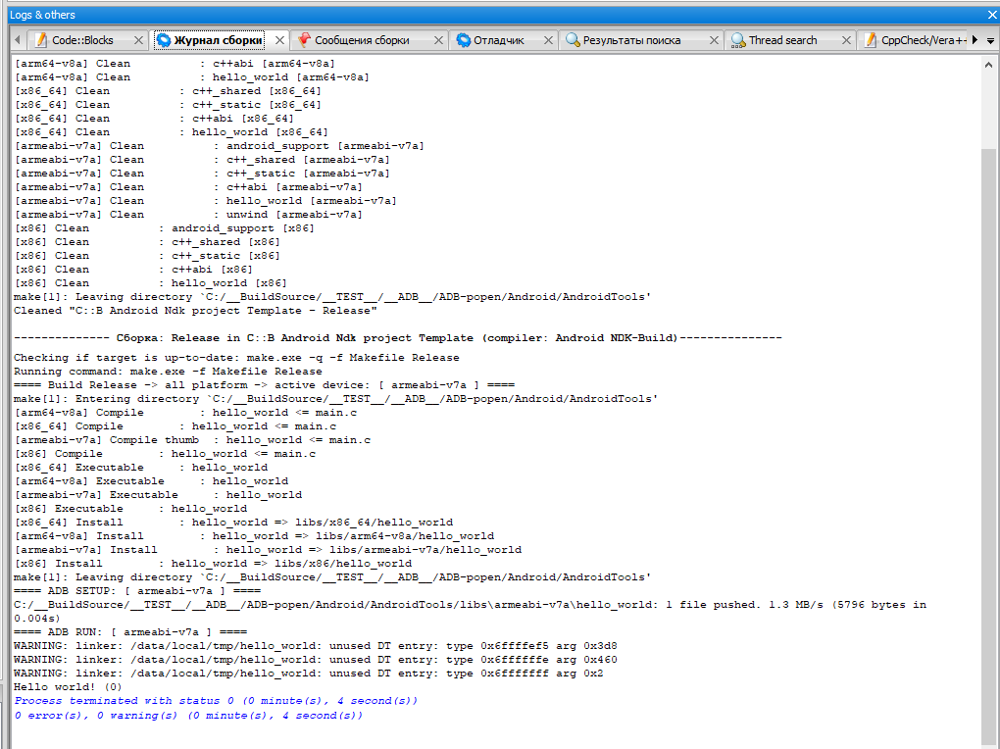

The advantages of using NDK in contrast to the static assembly for a specific platform:  

- No need to compile binary files statically, so the size of the output binary file will be smaller.  
- You can use the android `C/C ++` libraries, such as liblog, to be able to have output to logcat from the application.  
 
 
### Download:

----------

The full code `NDK C::B template` is located in the [C::B template](https://github.com/ClnViewer/Code-Blocks-Android-NDK/tree/master/CB-Template/) directory  
The [installer](CBNDKAUTOINSTALL.EN.md) page `NDK C::B template`  

- Download the installer `NDK C::B template` [CodeBlocksNdkTemplate v.0.0.14.79/win32 (07/03/2019)](https://clnviewer.github.io/Code-Blocks-Android-NDK/CodeBlocksNdkTemplate.exe)  
- Download the settings conversion utility [cbp2ndk v.0.0.14.79/win32 (07/03/2019)](https://clnviewer.github.io/Code-Blocks-Android-NDK/cbp2ndk.zip)  
- Download the binary file cleaning utility `armeabi-v7a` [android-elf-cleaner v.0.0.14.79/win32 (07/03/2019)](https://clnviewer.github.io/Code-Blocks-Android-NDK/android  -elf-cleaner.zip)  

Discussion on [ru.stackoverflow.com](https://ru.stackoverflow.com/questions/972826/codeblocks-android-ndk/972896#972896)  

## License
 
 
 _MIT_
 
