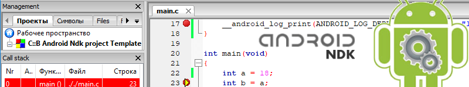

# Code::Blocks Android NDK HOWTO

### HOWTO/binary links:

| `Code::Blocks` project template __HOWTO__ | [EN](https://clnviewer.github.io/Code-Blocks-Android-NDK/README.EN.html) | [RU](https://clnviewer.github.io/Code-Blocks-Android-NDK/README.RU.html)  
| `Code::Blocks` project template [__auto installation__](https://github.com/ClnViewer/Code-Blocks-Android-NDK/tree/master/CB-Template/CodeBlocks/templates/wizard/ndk_android) | [EN](https://clnviewer.github.io/Code-Blocks-Android-NDK/CBNDKAUTOINSTALL.EN.html) | [RU](https://clnviewer.github.io/Code-Blocks-Android-NDK/CBNDKAUTOINSTALL.RU.html) | [exe](https://clnviewer.github.io/Code-Blocks-Android-NDK/CodeBlocksNdkTemplate.exe)  
| `Code::Blocks` settings conversion [__cbp2ndk__](https://github.com/ClnViewer/Code-Blocks-Android-NDK/tree/master/cbp2ndk) utility | [EN](https://clnviewer.github.io/Code-Blocks-Android-NDK/CBP2NDK.EN.html) | [RU](https://clnviewer.github.io/Code-Blocks-Android-NDK/CBP2NDK.RU.html) | [zip](https://clnviewer.github.io/Code-Blocks-Android-NDK/cbp2ndk.zip)  
| `Code::Blocks` binary file cleaning [__android-elf-cleaner__](https://clnviewer.github.io/Code-Blocks-Android-NDK/) | [zip](https://clnviewer.github.io/Code-Blocks-Android-NDK/android-elf-cleaner.zip)  utility  

### Source links:

----------

- source code `NDK C::B template` [manual installation](https://github.com/ClnViewer/Code-Blocks-Android-NDK/tree/master/CB-Template/)  
- source code `NDK C::B template` [auto installation](https://github.com/ClnViewer/Code-Blocks-Android-NDK/tree/master/CB-Template/CodeBlocks/templates/wizard/ndk_android)  
- source code `NDK C::B template` [installers](https://github.com/ClnViewer/Code-Blocks-Android-NDK/tree/master/CB-Template/autoinstall)  

### Discussion:

----------

- Discussion on [ru.stackoverflow.com](https://ru.stackoverflow.com/questions/972826/codeblocks-android-ndk/972896#972896)  

## License

_MIT_
