Начнем с малого, как прикрутить `Android NDK` к `C::B`

Есть два пути:

- 1. прописать на каждую платформу свой профиль, с исполняемыми файлами согласно платформе. На мой взгляд утомительно, много всего и непонятно зачем. С учетом что если собирать одно и тоже под все платформы, то объем телодвижений с переключением конфигураций довольно велик.
У меня по умолчанию собираются `arm64-v8a, armeabi-v7a, x86, x86_64`.

- 2. использовать родную систему сборки `ndk-build`. Это самое простое и изящное решение, не вступающее в конфликты с большинством проверок `C::B`, но, в настройках `C::B` важна каждая деталь, схема довольно капризная, и при неточностях может легко ломаться.

### Интеграция Android NDK

----------

Идеология и манера сборки максимально приближена к типовому поведению `C::B`, логика процессов:

- сборка в режиме `Release`- этапы: всегда новая сборка приложения, копирование его на устройство, запуса приложения. Все действия отображаются в консоле `C::B`.

- сборка в режиме `Debug`- этапы: всегда новая сборка приложения, копирование его на устройство, копирование `NDK-парт` файлов для отладки `gdbserver`, `gdb.setup`, запуск `gdbserver` на устройстве, ожидание подключения дебагера `GDB` для отладки.

- режим `запуска приложения`- этапы: запуск на устройстве приложения с выводом результатов в консоль.

- режим `Отладка -> Старт` - этапы: всегда новая сборка приложения, копирование его на устройство, копирование `NDK-парт`файлов для отладки `gdbserv`, `gdb.setup`, запуск `gdbserv` на устройстве, автоматическое подключение дебагера `GDB`и переход в режим отладки. Окно запускаемого `gdbserver` стартует в минимизированном состоянии и автоматически закрывается по окончани отладки.

### Файлы шаблона:

Сам проект `C::B`, важные секции:

- `<Build><Option output>` - указывает на скрипт дистанционного запуска приложения на устройстве - `RunRemote.cmd`. Скрипт генерируется автоматически.  
- `<Build><Option compiler="android_ndk-build">` - это обработанное название компилятора в настройках `C::B` - `Android NDK-Build`. Как завести учетную запись нового компилятора, показано ниже.

В секции `<Extensions><debugger><remote_debugging>` находятся настройки дистанционной отладки, реализованной с помощью `GDB`:

- `options ip_address="127.0.0.1" ip_port="59999" extended_remote="0"`, если есть необходимость изменить номер порта, то это так-же необходимо сделать в `Makefile`. Если опция `extended_remote` будет отличной от нуля, окно дистанционно запущенного `gdbserver` не закроется автоматически после отладки.

[**AndroidNdkTemplate.cbp**](../CB-%D1%88%D0%B0%D0%B1%D0%BB%D0%BE%D0%BD/AndroidNdkTemplate.cbp) - файл проекта `C::B`.  

### Исходные файлы управления сборкой в директории `NDK` проекта:

----------

[**Application.mk**](../CB-%D1%88%D0%B0%D0%B1%D0%BB%D0%BE%D0%BD/Application.mk) - устновки параметров сборки.  
[**Android.mk**](../CB-%D1%88%D0%B0%D0%B1%D0%BB%D0%BE%D0%BD/Android.mk) - собственно и является мейк-файлом уникальным для каждого `NDK` проекта (приложения).  
[**Makefile**](../CB-%D1%88%D0%B0%D0%B1%D0%BB%D0%BE%D0%BD/Makefile) - непосредственно запускается `C::B`:

Файлы `Application.mk` и `Makefile` являются универсальными для всех проектов собираемых с помощью `NDK` и не требуют правок.

Для понимания структуры где чего лежит в проекте `NDK` приложения, приведу дерево:

    │   Android.mk
    │   AndroidNdkTemplate.cbp
    │   Application.mk
    │   main.c
    │   Makefile
    ├───libs
    │   ├───arm64-v8a
    │   │       hello_world
    │   ├───armeabi-v7a
    │   │       hello_world
    │   ├───x86
    │   │       hello_world
    │   └───x86_64
    │           hello_world
    └───obj
        └───local
            ├───arm64-v8a
            │   │   hello_world
            │   └───objs
            │       └───hello_world
            │               main.o
            │               main.o.d
            ├───armeabi-v7a
            │   │   hello_world
            │   └───objs
            │       └───hello_world
            │               main.o
            │               main.o.d
            ├───x86
            │   │   hello_world
            │   └───objs
            │       └───hello_world
            │               main.o
            │               main.o.d
            └───x86_64
                │   hello_world
                └───objs
                    └───hello_world
                            main.o
                            main.o.d

### Вид настроек проекта из GUI `C::B`:

----------

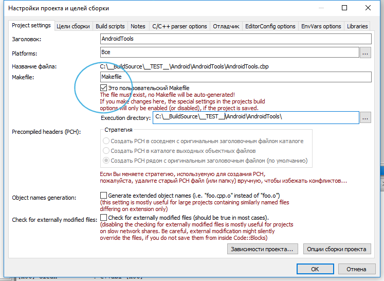

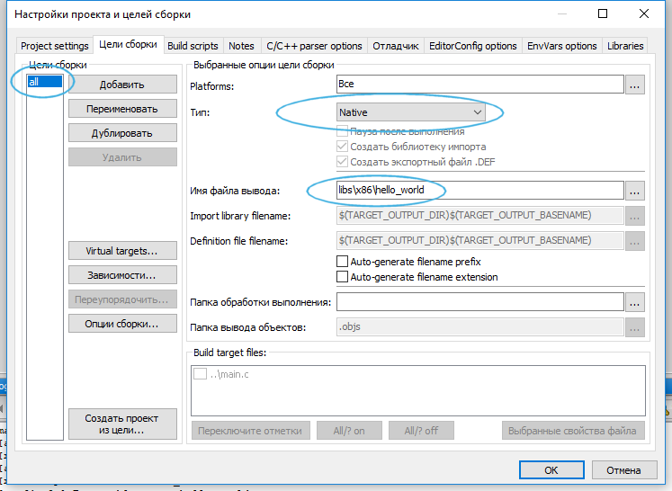

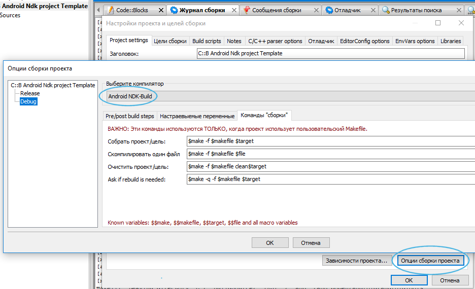

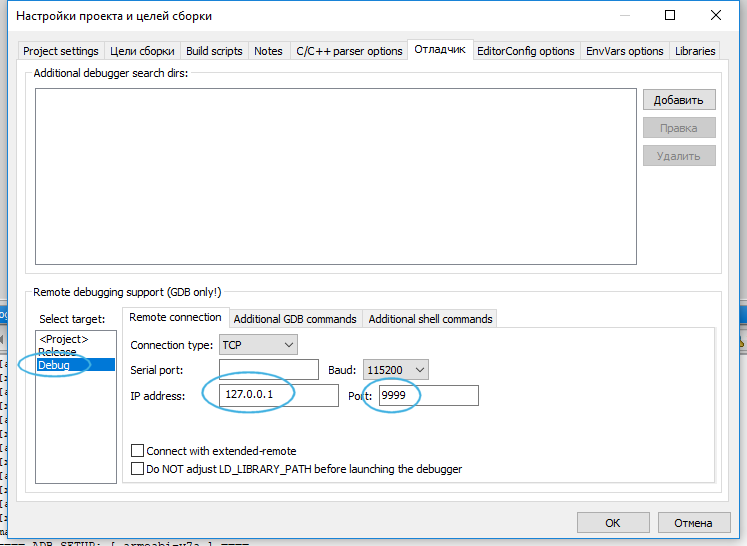

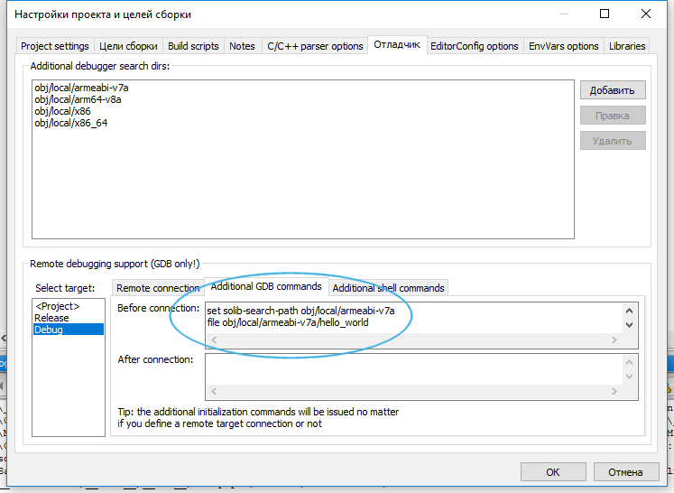

Необходимо добавить команды `GDB` передающие информацию о нахождении отладочных символов:

- `set solib-search-path obj/local/armeabi-v7a` - расположение отладочных символов для активного устройста.
- `file obj/local/armeabi-v7a/<имя приложения>`  - имя отлаживаемого приложения.  

### Вид настроек компилятора в `C::B`:

----------

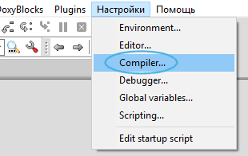

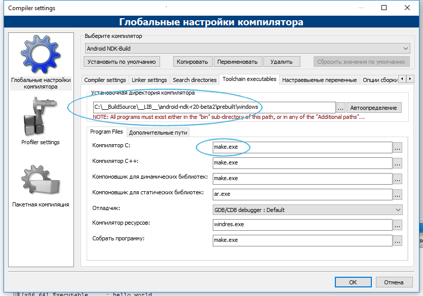

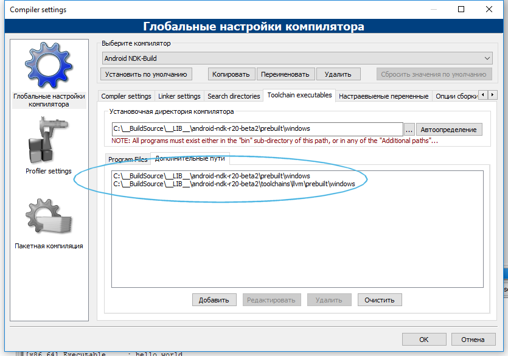

### Дополнительное меню отладки `NDK` приложения:

----------

Оба используемых в меню скрипта имеют фиксированное имя и генерируются автоматически, во время исполнения `Makefile`, для удобства разумно добавить их в меню:

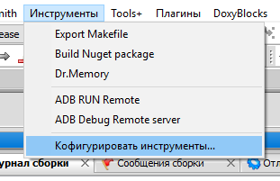

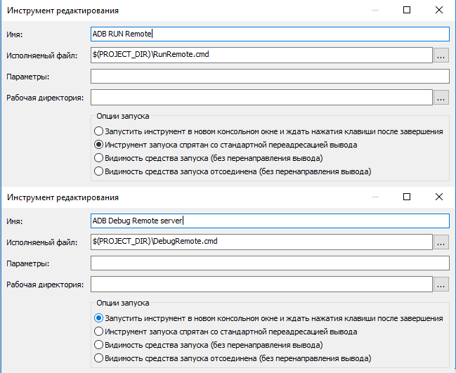

Метод отладки приложения состоит из типовых действий, например через `F8` или меню `Отладка -> Старт`. Как только запустился дебагер, вам надо вызвать из созданного меню пункт `ADB Debug Remote server`, этой командой вы запустите `GDB сервер` на устройстве, который запустит ваше приложение. Вы подключаетесь к `GDB серверу` дистанционно и можете проводить сеанс отладки. Смотрите скриншот настроек дебагера в проекте выше.

Данная схема запуска отладки поддерживает и не рутированные устройства.

### Глобальные настройки дебагера для `NDK` выглядят так:

----------

### Отладка на устройстве:

----------

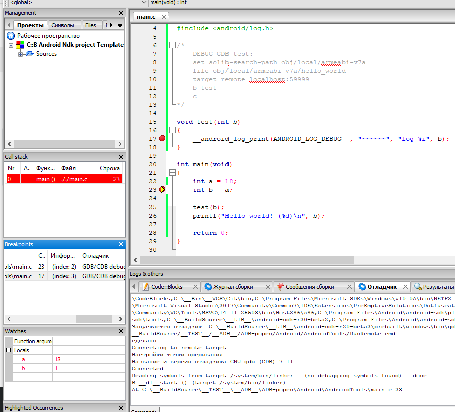

### Результат сборки приложения толчейном `NDK`:

----------

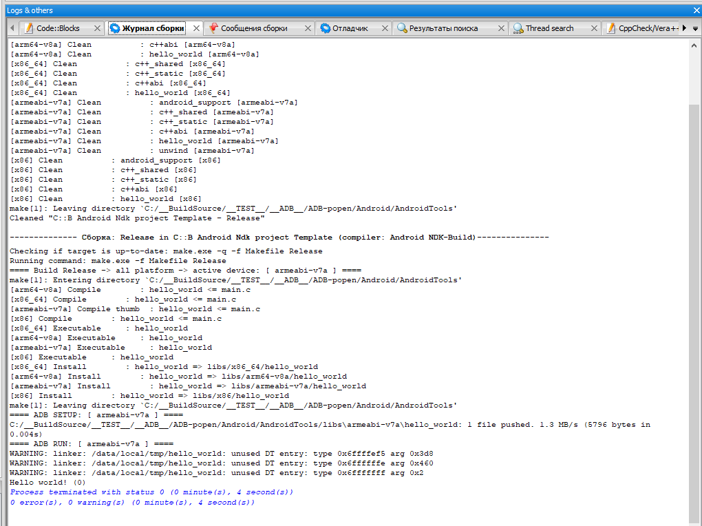

Преимущества использования NDK в отличии от статической сборки под определенную платформу:

- Не нужно компилировать двоичные файлы статически, поэтому размер выходного двоичного файла будет меньше.

- Можно использовать android `C/C++` библиотеки, такие как liblog, чтобы иметь возможность иметь вывод в logcat из аппликации.

Полный код `NDK C::B template` находиться в директории [CB-шаблон](https://github.com/ClnViewer/Code-Blocks-Android-NDK/tree/master/CB-%D1%88%D0%B0%D0%B1%D0%BB%D0%BE%D0%BD)

